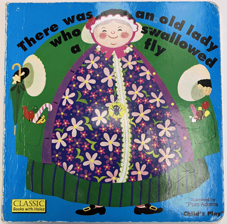

# "Old lady song" kata

## About the kata

Some years ago I learned about a kata based on a children's rhyme and song about an old lady.

I don't know where the kata originates from (a web search yields several occurences), but the lyrics can be found
[here](https://en.wikipedia.org/wiki/There_Was_an_Old_Lady_Who_Swallowed_a_Fly).

IIRC the kata was written in JavaScript, so I recreated it in Java.

## Target audience

This kata has proven helpful for learning mob programming (team programming / ensemble programming / software teaming)
and especially strong style navigation, and to learn programming practices like working in small steps (backed by an
approval test).

I have used it successfully in workshops not only with developers, but also across all roles involved in software
development – if the majority of the people in the session know how to write Java code.

And I found it suitable for non-native speakers, too, because you don't have to understand the lyrics. It's more about
identifying patterns, and that's easy (maybe easier?) even if you don't understand the words.

## Task and rules

### Your task:

Refactor the static text in the [Song](src/main/java/old_lady_song/Song.java) class into an algorithm that generates
the text by using constants, methods, structures, loops ... whatever. Readabilty does not matter in this kata, as
nothing is probably more readable than a complete, static text. But you are more than welcome to ensure clean (tidy)
code.

### The rules

- Use small refactoring steps
- Make sure that the [SongTest](src/test/java/old_lady_song/SongTest.java) is successful (green) before each refactoring!
- You are not allowed to change anything in the SongTest file in any way

You can practice the kata with additional goals, like using Java 21 features (records, text blocks etc.),
but I'd recommend using a syntax that most participants are familiar with (like Java 8 or 11) the first time.

### The end

- Finish this kata when you think you've done a decent job – or when time runs out.
- Do a short "mini retro" (5-10 minutes) about
  - either: what was good / how you felt / what you'd like to try differently next time
    (also suitable for a mini retro before the mid break)
  - or: what you liked / what you learned / what you'd like to try differently next time

## Notes

- Take your time. If you use this kata for a software teaming (mob programming) session, allow 2 hours (with lots of
  rotations and a small break inbetween).
- This repo uses Java 21, but you can practice the kata with Java 8 as well (and probably even below).

Have fun! 😊

## Trivia

There are even books about this rhyme 😍, for example

